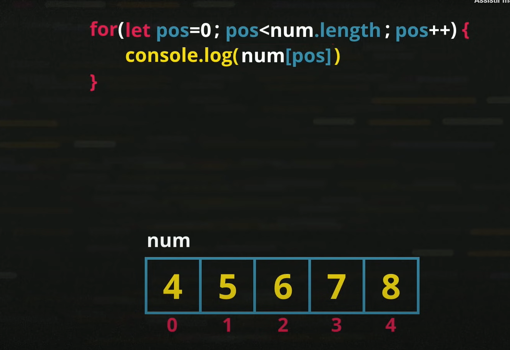

# JavaScript

# O que faz o JavaScript?
   interações entre o cliente e o website
# Cliente x Servidor
     JavaScript é uma tecnologia que funciona muito mais para cliente
# Website
    Como fosse um jornal
        jornalista, produção de conteudo responsavel por texto, imagem, video. (HMTL)
        designer, pegar o conteudo e organiza-los, tornar as coisas mais bonitas. (CSS)
        programador, tratar da engenharia da entrega, segurança, interação. (JS)

# Quem usa JavaScript ?
Google
Youtube
Linkedin
Netflix
Facebook

# Identificadores de variaveis

* Podem começar com letra, $ ou _
* Não podem comçar com números
* É possivel utilizar letras ou numeros
* É possivel usar acentos e simbolos
* Não podem conter espaços
* Não podem ser palavras reservadas, por exemplo comandos do JS

# Dicas de identificadores de variaveis

* Maisculas e minusculas fazem diferença
* Utilizar nomes coerentes para as variaveis
* Evite se tornar um "programdor alfabeto" ou um "programador contador"

# Diferenças de variaveis

* 5 18 -12 0.5 -15.9 3.14 8.0 = Number
* "Gooogle" 'JavaScript' `Maria` = String
* True, false = Boolean

# Manipulação de Dados
* Conversão de string para numero:
 * Number.parseInt(n) ➡ numero inteiro
 * Number.parseFloat(n) ➡ numero real
 * Number(n)➡ O proprio JS decide com o valor que é dado se é real ou inteiro

* Conversão de numero para string
 * String(n)
 * n.toString()

# Formatando Strings
 * var s = 'JavaScript'
 'Eu estou aprendendo s' ➡ não faz interpolação
 'Eu estou aprendendo ' + s ➡ usa concatenação
 `Eu estou aprendendo ${s}` ➡ usa template string

* s.length ➡ quantos caracteres tem uma string
* s.toUpperCase() ➡ muda tudo para letras maiusculas
* s.toLowerCase() ➡ muda tudo para letras minusculas

# Formatando Numeros
* n1.toFixed(2)
* n1.toFixed(2).replace ('.', ',')
* n1.toLocaleString('pt-BR', {style: 'currency', currency: 'BRL'})

# Operadores 
* Aritimeticos, Atribuição, Relacionais, Logicos, Ternario

* Aritmeticos
5 + 2 ➡ 7
5 - 2 ➡ 3
5 * 2 ➡ 10 ➡ Multiplicação
5 / 2 ➡ 2.5 ➡ divisão real
5 % 2 ➡ 1 ➡ Resto da divisão inateira
5 ** 2 ➡ 25 ➡ potencia

* obs: Cuidado!
5 + 3 / 2 ➡ 6.5
(5 + 3) / 2 ➡ 4

* Ordem de Precedendcia dos operadores aritmeticos
⬇ ()
⬇ ** 
⬇ */%
⬇ +-

* Atribuição simples
var a = 5 + 3 ➡ 8
var b = a % 5 ➡ 3
var c = 5 * b ** 2 ➡ 45
var d = 10 - a / 2 ➡ 6
var e = 6 * 2 / d ➡ 2
var f = b % e + 4 / e ➡ 3

* Auto-atribuições
var n = 3 ➡ 3
n = n + 4 ➡ 7
n = n - 5 ➡ 2
n = n * 4 ➡ 8
n = n / 2 ➡ 4
n = n ** 2 ➡ 16
n = n % 5 ➡ 1

* Simplificando atribuições
n = n + 4 ➡ 7 ➡ n+=4
n = n - 5 ➡ 2 ➡ n-=5
n = n * 4 ➡ 8 ➡ n*+4
n = n / 2 ➡ 4 ➡ n/=2
n = n ** 2 ➡ 16 ➡ n**=2
n = n % 5 ➡ 1 ➡ n%=5

* Incremento
var x = 5
x = x + 1 ➡ 6 ➡ x++
x = x - 1 ➡ 5 ➡ x--

* Relacionais
5 > 2 ➡ true
7 < 4 ➡ false
8 >= 8 ➡ true
9 <= 7 ➡ false
5 == 5 ➡ true
4 != 4 ➡ false

* Identidade - obs: tres sinais difere do tipo e 2 do valor
5 == 5 ➡ true
5 == '5' ➡ true
5 === '5' ➡ false
5 === 5 ➡ true
5 != '5' ➡ false
5 !== '5' ➡ true

* Lógicos - obs: ordem de excução e: primeiro o 'nao' o 'e' e o 'ou'
! negação ➡ 'nao' logico ➡ ! true ou false

&& conjunção ➡ 'e' logico 
    Somente quando os dois valores sao verdadeiros que a resposta sera verdadeiro
        true  &&  true ➡ true
        true  &&  false ➡ false    
        false &&  true ➡ false 
        false &&  false ➡ false

|| disjunçaõ ➡ 'ou' logico
    Se um valor for verdadeiro a reposta sera verdadeira
        true  || true ➡ true
        true  || false ➡ true
        false || true ➡ true
        false || false ➡ false

* Ternário
?
:

teste ? 'Aprovado' : 'Reprovado'

# DOM
* O que é ?
Document Object Model ➡ Modelo de objetos para documentos

* Arvore DOM
Começa da raiz 'window' tudo dentro do JavaScript está dentro dela.
location ➡ diz qual a localização do site
document ➡ documento atual
        html
            head
                meta title
            body
                h1 p p div
                    strong
History ➡ guarda de qual pagina veio e para onde vai

* Selecionando elementos
 por MARCA
getElementsByTagName() ➡ Consegue selecionar varios obejtos, por ter ojetos com a mesma tag

 por ID
getElementById() ➡ Seleciona o objeto por ID

 por NOME
getElementsByName() ➡ 

 por CLASSE
getElementsByClassName() ➡

 por SELETOR
 querySelector()
 querySelectorAll()

 # Eventos DOM
 Tudo aquilo que pode acontecer com qualquer elemento,
 mouseenter, mousermove, mousedown, mouseup, click, mouseout, existem varios outros...

 # Funções
 function ação(parametros){
    BLOCO
 }

 # Condições em JS
 * Sequencias 
 Var n = 3
 n += 2 
 window.alert(n)
 5
----------------------
 if (condição){
        true
 }else{
        false
 }

 * Condição, multipla
 switch (expressão){
    case valor 1:

    break //sempre tem que escrever o break

    case valor 2:

    break

    case valor 3:

    break

    default:

    break
 }

# exercicio 
* imagem de planejamento de site:

# Estrutura de Repetição

* Repetições com teste no inicio

    while(temFatia()){
        comerFatia()
    }

* Repetições com teste no final

do{

}while(condição)

* Repetições com controle

# Variaveis Compostas

* Devem ser capazes de armazenar vários valores em uma mesma estrutura.
 

 
 
num[3] = 6 ➡ cria o identificador 3 e ele recebe 6

num.push(7) ➡ cria na ultima posição um identificador e ele recebe o valor que está entre parentese

num.length ➡ fala quantos identificadores tem no vetor

num.sort() ➡ coloca os valores em ordem crescente

num.indexOf(7) ➡ procura o valor que está dentro do parentese 

# Funções em JS
* Funções são ações executadas assim que são chamadas ou em decorrência de algum evento.
* Uma função pode receber parâmentros e retornar um resultado

